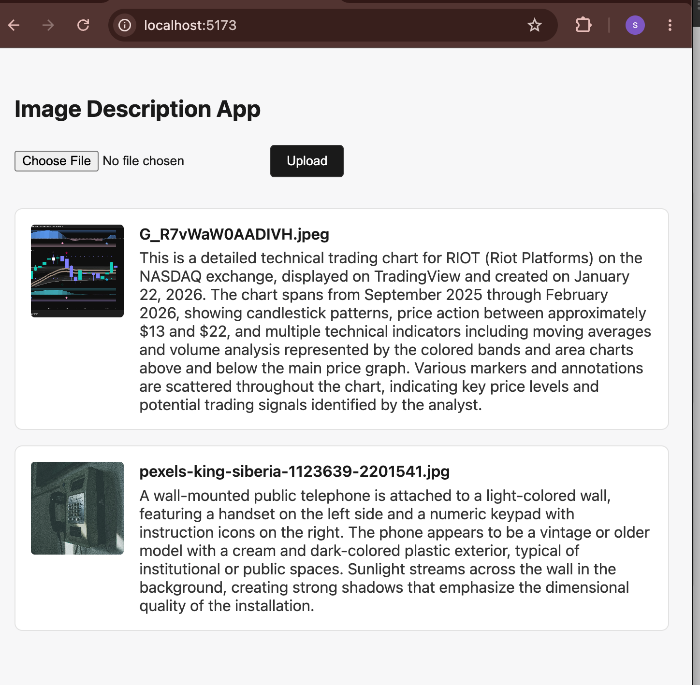
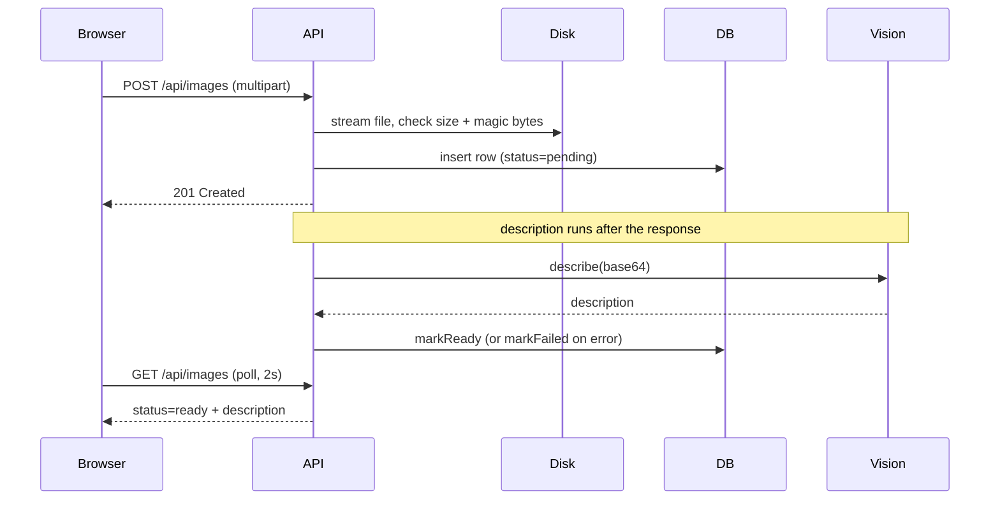

# Image Description App

Upload an image, get a 2-3 sentence AI-generated description of it.



## Setup

**Requires Node 20.6+** (the dev script uses Node's native `--env-file` flag).
Developed and tested on Node 21.6.1.

```bash
npm install
cp .env.example .env
```

Then edit `.env` and pick one path:

**With a real API key** — set `ANTHROPIC_API_KEY=sk-ant-...`. Descriptions come
from `claude-haiku-4-5-20251001`.

**Without one** — uncomment `USE_FAKE_VISION=true`. The server skips the key
check and returns a canned description for every upload. This is also what the
test suite uses, so no test makes a network call.

```bash
npm run dev        # API on :3000, Vite dev server alongside it
npm test           # repository + route tests
npm run typecheck  # strict TypeScript across both workspaces
```

Vite defaults to port 5173 but takes the next free one if that's occupied —
open whichever URL the `web` process prints.

## What was built

`POST /api/images` streams the upload straight to disk (never buffering the
whole file), validates the declared MIME type and the file's actual magic
bytes, inserts a `pending` row, and returns `201` immediately. A fire-and-forget
task then reads the file, calls the vision client, and marks the row `ready`
with a description or `failed` with the error. The frontend polls
`GET /api/images` every 2s while anything is pending and stops as soon as
nothing is, rendering three states per card: a spinner, the description, or the
failure message. `GET /api/images/:id/file` streams the stored bytes for the
thumbnail.

Verified end to end against the real Anthropic API — upload, description, and
the `failed` path with an invalid key — not only against the fake client.



## Key decisions

**Async description, never a blocking upload.** The vision call takes seconds,
and holding the HTTP connection open for it couples the upload's success to a
third-party API's availability. Instead the `status` column
(`pending` → `ready`/`failed`) is the only state a client tracks, and the
polling loop is driven entirely by it.

**Validation lives in the route, not the vision client.** `POST /api/images` is
the primary gate: it rejects a disallowed MIME type (`415`) and a MIME/bytes
mismatch (`422`) before the vision client is ever reached. The client's own MIME
check is defense in depth, and its JSDoc says so — that contract isn't visible
from the interface signature.

**`Config` is a discriminated union, not an optional field.**
`{ useFakeVision: true }` vs `{ useFakeVision: false; anthropicApiKey: string }`
means the vision factory narrows on `useFakeVision`, so there is no non-null
assertion anywhere in the codebase.

## Tradeoffs

**No ORM.** One table, five prepared statements, `db/images.ts` the only file
allowed to touch SQL. Drizzle would have added a schema file, a config, a
generate step, and a migrations directory to produce the same queries with types
that took ten lines to write by hand. The cost is that `better-sqlite3` returns
`unknown`, so the row-to-record mapping isn't verified at runtime — with a
second table or real migrations I'd have reached for it.

**GET and POST only.** Every state transition is driven internally by the vision
pipeline, not by a client editing a resource. There's no update or delete a
caller needs to make, so there's no verb for it.

**No graceful shutdown.** No `SIGTERM` handler, no `db.close()`, nothing drains
in-flight description tasks. Concretely: restarting the server mid-description
strands that row in `pending` forever, since nothing retries it. In production
this work belongs on a queue with retries and a dead-letter path; the brief
ruled out external infrastructure, so this is the smallest thing with the same
shape — swapping the in-process call for a queue consumer wouldn't touch the
route or the frontend.

**Dependency majors chosen for what runs, not what's newest.** better-sqlite3
12/13, Vite 8, and concurrently 10 all require Node ≥22 and fail at import on
this project's Node 21.6.1 — verified by loading them, not by reading the
`engines` field. An `overrides` entry pins `@vitejs/plugin-react`'s `vite` to
match web's, since npm's dedupe otherwise reuses vitest's bundled `vite@5` and
breaks the typecheck.

**`npm install` reports vulnerabilities — all dev-only.** Every advisory traces
to esbuild bundled by Vitest 2, and concerns esbuild's dev server accepting
cross-origin requests. Nothing ships to production. The fix path is Vitest 4,
two majors of churn for no runtime benefit at this scope.

**`@fastify/multipart` doesn't throw on the size limit when streaming.** Its
automatic rejection only fires through `.toBuffer()`; with `pipeline()` it just
sets `file.truncated`. Verified empirically, so the route checks `truncated`
explicitly and throws its own `413`.

**Prompt tightened rather than stripping markdown server-side.** The real API
returned a markdown heading despite a prompt asking for plain prose. Fixing the
prompt means the behaviour is verified against the model; a stripping layer
would have hidden a prompt problem in code.

**No `dotenv`.** The dev script uses Node's native `--env-file`. One cost: on
Node 21 that flag hard-errors on a missing file, so a reviewer who skips
`cp .env.example .env` sees `node: ../.env: not found` rather than the app's own
message about the key.

## What I'd build next

- **Graceful shutdown and recovery for stranded rows** — a `SIGTERM` handler
  that drains in-flight work, plus a boot-time sweep that retries or fails any
  row left `pending` by a previous process.
- **Push instead of polling** — SSE or a WebSocket, so the client learns about
  status changes rather than asking every two seconds.
- **Object storage** — local disk means a single machine, and it's also where
  the filesystem and database can drift apart.
- **Pagination** — `GET /api/images` currently returns every row unbounded.
- **Auth and rate limiting** — anyone who can reach the server can upload and
  read every image.

## How I used AI tooling

I used Claude Code for the implementation, driven by a committed
[`CLAUDE.md`](./CLAUDE.md) holding the constraints: pinned framework versions,
no new dependencies without asking, no SQL outside the repository module, GET
and POST only, and an explicit list of things not to build. Most of the value
came from those constraints rather than from prompting — the default failure
mode of an agent on a task like this is quietly accumulating dependencies and
abstraction, and a written "ask first" rule is what stops it.

I worked in five reviewed phases, reading the diff and running the app between
each; the commit history reflects that. After every change the agent ran
`npx tsc --noEmit && npx vitest run` and fixed failures before reporting back,
so it caught its own type errors rather than handing me code that didn't
compile. That isn't TDD — tests were written alongside the implementation. The
point was giving the agent a way to check itself.

**Where I overrode it:**

- It replaced Node's `--env-file` with a hand-rolled `.env` parser, justifying
  it with "Node in this project's target version has no stable built-in
  equivalent." `node --version` said 21.6.1; `--env-file` landed in 20.6. The
  reasoning was plausible and wrong, and owning a custom env parser is worse
  than the dependency it avoided.
- It pinned `@anthropic-ai/sdk` at `^0.32.1` — the version in its training data,
  roughly two years behind the published `0.122.0`. On a pre-1.0 SDK that gap
  spans breaking changes to the message API. `npm view` caught it; nothing else
  would have, since the version resolves and the code compiles. It only fails on
  a real API call.
- Its `insertPending` minted its own UUID, independent of the id the route had
  already generated to name the file on disk. Harmless today, since everything
  reads `storage_path` from the row — but the filename and the record id would
  never have matched.
- The first real API call returned a markdown heading despite the prompt asking
  for plain prose. No test could have caught this: the fake client returns clean
  text by construction.

**Where it caught things I wouldn't have.** Told to bump `better-sqlite3` to 13,
it loaded the native module directly, found a segfault on Node 21, and stopped
to ask rather than shipping something that couldn't run. It did the same for
`concurrently` and Vite, and verified `@fastify/multipart`'s size-limit
behaviour empirically instead of trusting the docs.

The pattern: the agent is reliable about mechanism and unreliable about facts it
can't check — versions, environment capabilities, model behaviour. Everything in
that second category I verified against the registry, the runtime, or a real API
call before accepting it.